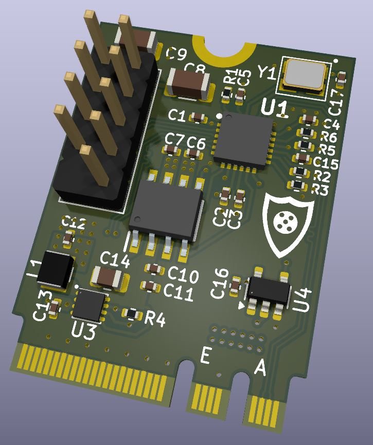

# M.2-to-USB Adapter Card

## Overview
The M.2 to USB adapater uses the single USB 2.0 lane on the A/E Key M.2 slot to make an USB 2.0 front panel connector. The board uses the Microchip USB2422 2 port USB 2.0 hub chipset.
## Specifications
1. 500mA per port
2. Short circuit protection
3. 2 USB 2.0 ports (combined into standard internal PC header)
4. 2230 A & E Key compatibility
## Instructions

* [Ordering Instructions](Instructions/PCB_Order_Instructions.md)
* [KiCad Instructions](Instructions/KiCad_Install_Instructions.md)
* [Soldering Instructions](Instructions/Soldering_Instructions.md)

The board is free to use for personal use only. 
